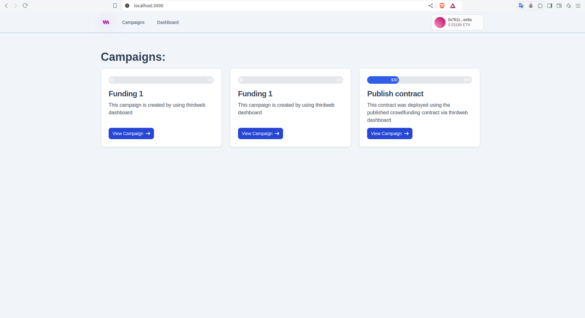
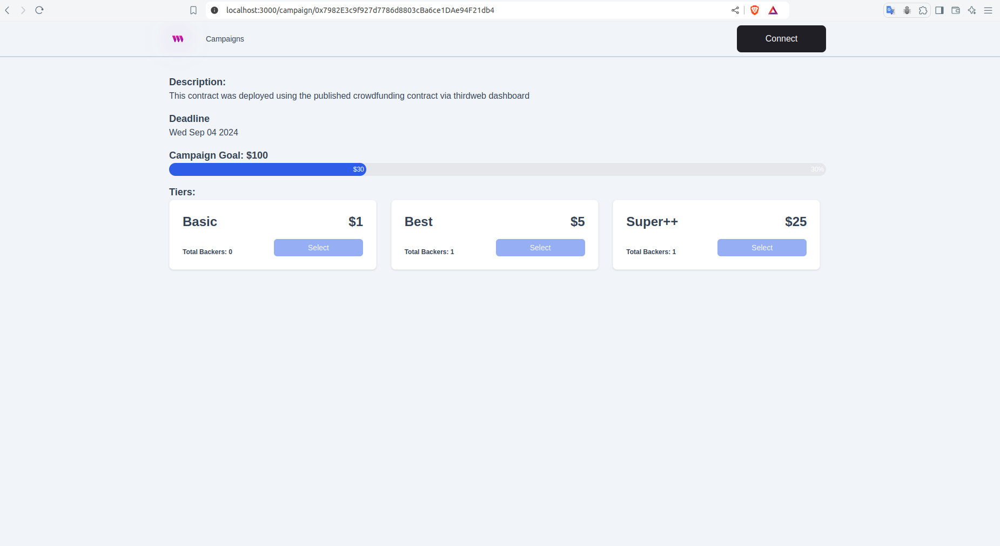

# Crowdfunding DApp

Welcome to the Crowdfunding DApp project! This decentralized application (DApp) enables users to create and participate in crowdfunding campaigns using blockchain technology. Built with Next.js and the Thirdweb library, this project leverages modern web development practices and decentralized finance (DeFi) capabilities to offer a seamless, transparent, and secure crowdfunding experience. 

## Features

- Create Campaigns: Users can create new crowdfunding campaigns by specifying the project details, funding goals, and deadlines.
- Support Campaigns: Backers can browse active campaigns and contribute funds directly from their wallets.
- Real-Time Updates: Track the progress of campaigns in real-time, including the amount raised and the time remaining.
- Decentralized Transactions: Utilize blockchain technology for secure and transparent transactions.
- User-Friendly Interface: Enjoy a smooth, intuitive user experience thanks to the power of Next.js and modern React components.
- Wallet Integration: Seamlessly connect with popular cryptocurrency wallets for easy fund management.

 

## Tech Stack

- Next.js: A React framework that enables server-side rendering, static site generation, and optimized performance.
- Thirdweb: A library for easily interacting with blockchain contracts and building Web3 applications.
- Ethereum: The underlying blockchain for smart contracts and decentralized transactions.
- Tailwind CSS: A utility-first CSS framework for building responsive and customizable UIs.

## Getting Started

Prerequisites:

- Node.js (v14 or higher)
- npm or yarn
- MetaMask or another Ethereum wallet

## Acknowledgements

- [Next.js](https://nextjs.org/)
- [Thirdweb](https://thirdweb.com/)
- [Tailwind CSS](https://tailwindcss.com/)

Feel free to reach out with any questions or suggestions!
